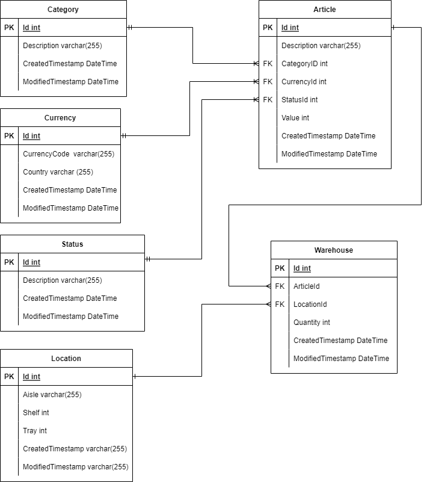

# Warehouse Management System

This application serves as a backend for a warehouse.
It can be connected with a MySQL Database in Production, but the Development Setup runs with an H2 Database. The MySQL Database needs to be set up separately first, see [here](https://www.mysql.com/). 
You can find the postman collection for all endpoints [here](src/main/resources/postman/CAS Lagerverwaltung.postman_collection.json).

## Requirements

For building and running the application you need:

- [JDK 17](https://www.oracle.com/java/technologies/downloads/#java17)
- [Maven 3](https://maven.apache.org)

The configuration is listed in the [pom-file](pom.xml)

## Running the application locally

The application listens on http://localhost:8080/api

### Development mode

One way is to execute the main method in the package com.example.warehousesystem.ManagementToolApplication class from your IDE.

Alternatively you can use the Spring Boot Maven plugin like so:

`mvn spring-boot:run -Dspring-boot.run.arguments=--spring.profiles.active=h2,dev`

You can find the h2 console under this link http://localhost:8080/api/h2console

### Production mode
H2

`mvn spring-boot:run -Dspring-boot.run.arguments=--spring.profiles.active=h2,prod`

MySQL

`mvn spring-boot:run -Dspring-boot.run.arguments=--spring.profiles.active=mysql,prod`

## Unit tests

Starts all the unit tests

`mvn test` or press CTRL + Shift + F10 (in IntelliJ)

## Produce a jar

`mvn clean package`

or

`mvn clean install`

## Warehouse Logic

## Endpoints

Details are documented [here](src/main/resources/documentation/Doku%20Rest%20API.xlsx).
Generally, the endpoints are structured in the following way:

### /'entities'
GET endpoint to retrieve a list of all existing entries of type 'entity'.

### /'entities'/id
GET endpoint to retrieve an entity with the specific id.

### /'entities'/id
PUT endpoint to modify an entity with the specified id.

### /'entities'/id
POST endpoint to add a new entity that is attached in the request body.

### /'entities/delete/id
With a DELETE request you can delete the corresponding entity with the given ID.

### /warehouse/upload
This endpoint only exists for the warehouse entity. 
Make a GET request to this endpoint with an csvFile with a predefined layout.
All entities in it will be either newly created and saved into the DB or if they already exist, will be updated.

### /'entities/csv
GET endpoint to download a csv-file with all entries of type 'entity'.

## Architectural Decision Record (ADR)

### ADR 1:
DELETE response is 204 (NO_CONTENT) with an empty body, following RFC 7231 (see
https://stackoverflow.com/questions/25970523/restful-what-should-a-delete-response-body-contain )

### ARD 2:
Test naming convention:
ExpectedBehavior_When_StateUnderTest
